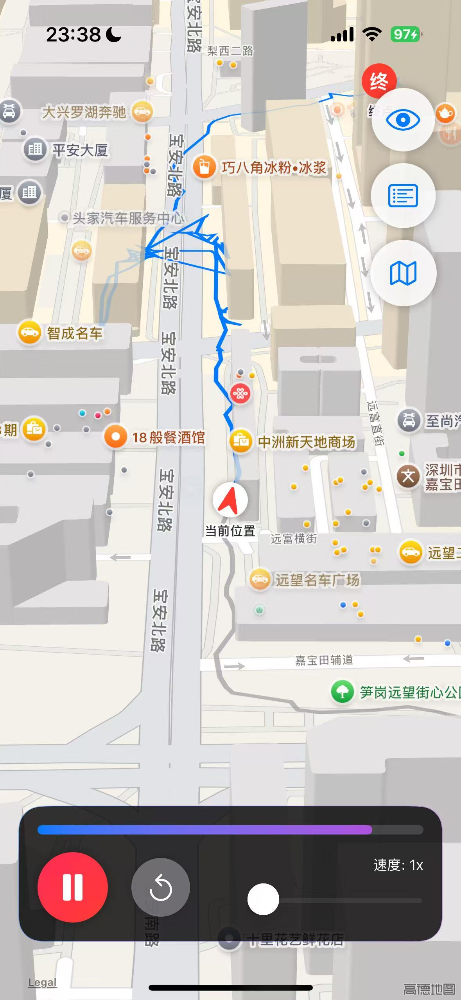
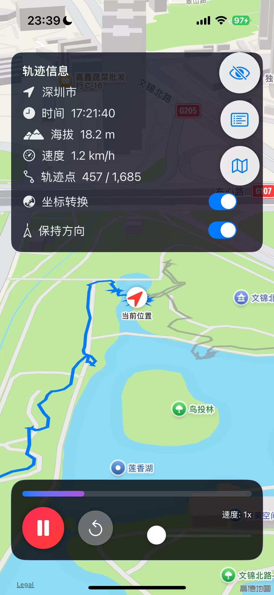

# GPSMap - GPX 轨迹播放器

一个功能强大的 iOS 应用，用于播放和管理 GPX 轨迹文件，支持 3D 地图视图和轨迹动画播放。

## 远程仓库

GitHub: https://github.com/buld-your-own-x-with-ai/GPXViewer

## Screenshots

### 应用界面展示

#### 方向指示箭头


当前位置显示为红色箭头，清晰指向运动方向，提供直观的导航体验。

#### GPS 信息面板


详细的轨迹信息显示，包括时间、海拔、速度等实时数据，支持坐标转换和方向控制。

#### 演示视频
<video src="Screenshots/Video.mp4" width="80%" controls>
  您的浏览器不支持 video 标签，请更新浏览器后查看。
</video>

完整的应用使用演示，展示轨迹播放、地图交互和各项功能操作。

## 功能特性

### 🎯 核心功能
- **GPX 轨迹播放**: 支持播放、暂停、重置轨迹动画
- **3D 地图视图**: 提供沉浸式的 3D 地图体验，支持多种地图样式
- **实时信息显示**: 显示当前位置、海拔、速度、时间等信息
- **可调节播放速度**: 1x-100x 速度调节

### 📁 GPX 文件管理
- **文件导入**: 支持从其他 App 分享 GPX 文件到本应用
- **文件列表**: 查看所有已保存的 GPX 文件
- **文件操作**: 重命名、删除、加载 GPX 文件
- **文件信息**: 显示文件大小、添加日期等详细信息
- **手动导入**: 通过文档选择器手动选择 GPX 文件

### 🗺️ 地图功能
- **多种地图样式**: 标准、卫星、混合地图
- **智能轨迹可视化**: 
  - 已经过的轨迹显示为灰色
  - 未经过的轨迹显示为彩色渐变
- **方向指示箭头**: 当前位置显示为红色箭头，指向运动方向
- **起终点标记**: 清晰标识轨迹起点和终点
- **实时跟踪**: 当前位置和方向实时更新
- **坐标转换**: 支持坐标系转换功能
- **保持方向**: 可选择保持当前地图方向，避免频繁旋转
- **信息面板**: 可收起/展开轨迹信息显示面板

## 使用方法

### 导入 GPX 文件

#### 方法1: 从其他 App 分享
1. 在其他 App 中（如邮件、文件管理器等）找到 GPX 文件
2. 点击分享按钮
3. 选择"GPSMap"应用
4. 文件将自动导入并可立即播放

#### 方法2: 手动导入
1. 打开应用
2. 点击右上角的列表按钮（📋）
3. 在 GPX 文件列表页面，点击左上角的"+"按钮
4. 从文档选择器中选择 GPX 文件
5. 文件导入成功后会自动加载

### 管理 GPX 文件
1. 点击主界面右上角的列表按钮进入 GPX 文件管理页面
2. 在文件列表中可以：
   - **加载文件**: 点击文件名或点击菜单中的"加载"
   - **重命名**: 点击菜单中的"重命名"
   - **删除文件**: 点击菜单中的"删除"

### 播放控制
- **播放/暂停**: 点击底部的播放按钮
- **重置**: 点击重置按钮回到轨迹起点
- **调节速度**: 使用底部的速度滑块调节播放速度
- **切换地图**: 点击右上角的地图按钮切换地图样式
- **保持方向**: 在轨迹信息面板中开启"保持方向"开关，地图将不再根据运动方向自动旋转
- **收起信息**: 点击右上角的眼睛图标可以收起/展开轨迹信息面板

## 技术特性

### 坐标转换
- 支持不同坐标系之间的转换
- 可在轨迹信息面板中开启/关闭坐标转换功能

### 用户体验优化
- **方向控制**: 新增"保持方向"选项，避免地图方向转动过于频繁，提供更稳定的观看体验
- **界面简化**: 支持收起轨迹信息面板，获得更大的地图显示区域
- **直观控制**: 所有主要功能都可通过简单的点击或开关操作完成
- **视觉反馈**: 
  - 当前位置使用箭头图标，清晰指示运动方向
  - 轨迹颜色区分已走过和未走过的路径
  - 提供更直观的进度视觉反馈

### 文件存储
- GPX 文件安全存储在应用沙盒中
- 支持文件元数据管理
- 自动清理无效文件引用

### 性能优化
- 高效的轨迹点处理
- 流畅的动画播放
- 内存优化的地图渲染

## 项目配置

### 支持的文件类型
应用支持以下 GPX 文件格式：
- `.gpx` 文件
- MIME 类型: `application/gpx+xml`
- UTI: `com.topografix.gpx`

### 系统要求
- iOS 18.5+
- Xcode 16+
- Swift 5.0+

## 开发说明

### 主要组件
- `TrackViewModel`: 核心业务逻辑和GPX文件管理
- `ContentView`: 主界面和地图显示
- `GPXListView`: GPX文件列表管理
- `DocumentPicker`: 文档选择器组件
- `GPXParser`: GPX文件解析器

### 文件结构
```
GPSMap/
├── GPSMapApp.swift          # 应用入口
├── ContentView.swift        # 主视图
├── TrackViewModel.swift     # 视图模型
├── GPXListView.swift        # 文件列表视图
├── DocumentPicker.swift     # 文档选择器
├── GPXParser.swift          # GPX解析器
└── Assets.xcassets/         # 资源文件
```

### 数据存储
- GPX 文件存储在 `Documents/GPXFiles/` 目录
- 文件元数据保存在 `UserDefaults` 中
- 支持文件完整性检查

## 许可证

本项目采用 MIT 许可证。详见 LICENSE 文件。

## 贡献

欢迎提交 Issue 和 Pull Request 来改进这个项目。

---

**注意**: 为了完整支持从其他 App 导入 GPX 文件，需要在 Xcode 项目设置中配置文档类型支持。具体配置方法请参考 iOS 开发文档中的"Document Types"部分。